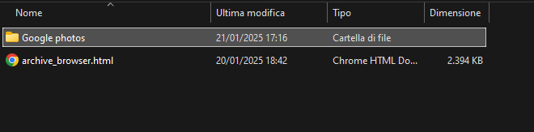
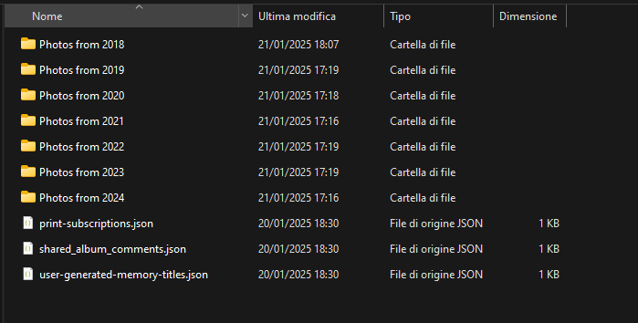

# Google Takeout Photo Metadata Integration Tool

This tool automates the process of integrating metadata from JSON files, downloaded via Google Takeout, into the corresponding photos and videos. The tool extracts timestamps and other relevant metadata from the JSON files and embeds them into the EXIF data of images or modifies the file's creation and modification timestamps.

## Features

- Processes image files (JPEG, PNG, JPG) and video files (MP4) downloaded from Google Takeout.
- Embeds photo metadata, such as timestamps and geolocation, into the EXIF data of images.
- Modifies the creation and modification timestamps of the files based on the metadata.
- Supports batch processing of files in folders and subfolders.
- Copies the original files to a new directory while updating the metadata, leaving the original files *intact*.

## Prerequisites

- Python 3.x
- Required libraries:
  - `piexif` for handling EXIF data in images.
  - `tqdm` for displaying progress bars during processing.
  - `tkinter` for the graphical file selection dialog.

The required libraries can be installed via `pip`:

```bash
pip install piexif tqdm
```

## Windows Executable (.exe) Release. _Recommended_

For users who prefer a quicker and more convenient method, an executable file (.exe) of this tool has been provided in the **Releases** section of this repository. Using the executable file is significantly faster and easier compared to running the Python script manually.

### Instructions for Using the Executable:

1. Visit the **Releases** section of this repository on GitHub.
2. Download the latest `.exe` file.
3. Simply double-click the `.exe` file to run the tool.
4. Follow the on-screen prompts to select the input and output folders.

By using the `.exe` version, you can skip the setup process and directly start processing your files.

Please note that this executable is designed for Windows users. If you're using a different operating system, the Python script method should be followed as outlined earlier.


## Input Folder Structure

For the tool to function correctly, the input folder must contain subfolders organized by year, and each year folder should contain the respective photos and video files. The tool will process each file in these subfolders and attempt to find corresponding JSON files with metadata for each photo and video.

### Example Folder Structure:
- **`Input Folder`**: This is the main folder containing all your photos and videos.
- **Year-based subfolders**: Inside the main input folder, create separate subfolders for each year (e.g., `2020`, `2021`).
- **Photos and videos**: Each year folder should contain the corresponding image and video files (e.g., `photo1.jpg`, `video1.mp4`).
- **Metadata files**: Alongside each image or video file, there should be a corresponding `.json` file containing metadata (e.g., `photo1.jpg.json`).

The program will use the metadata in the JSON files to update the EXIF data of the photos and modify the timestamps of the videos.



